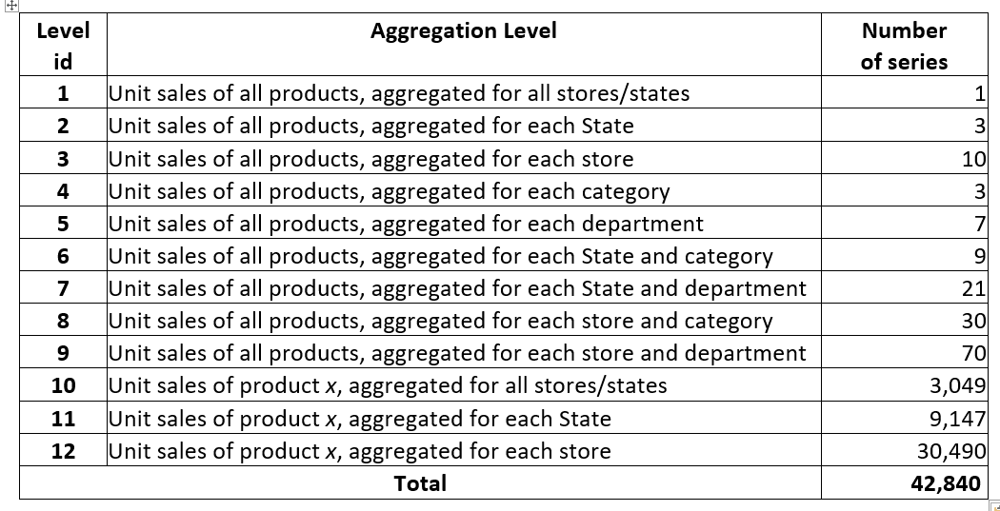

# urChampKaggle
Just a repo for our Kaggle project 

The project's overview can be found below:

https://www.kaggle.com/c/m5-forecasting-accuracy/overview

- Prediction 1 (Jasmine "Wen-Yu" Kuo): [LGBM Parameter](https://github.com/velwu/urChampKaggle/blob/master/Jasmine_EDA/Walmart%20Prediction.ipynb)

- Prediction 2 (Katy "Yun-Hsuan" Chuang):[Weighted Feature Events](https://github.com/velwu/urChampKaggle/blob/master/Katy_EDA/Add%20Weighted%20Feature_Events.ipynb)

- Prediction 3 (Lisa "Chien-Ju" Chen):[LSTM](https://github.com/velwu/urChampKaggle/blob/master/Chien_EDA/LSTM_Ver2_Final.ipynb)

# 12 Levels of Aggregation:

The final is expected to be Level 12, but starting at some other levels might ease the mind a bit~~~
